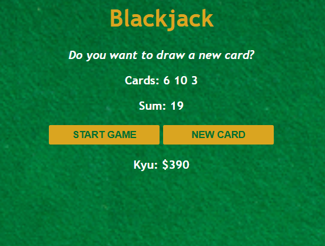

# Blackjack Simple

Mini project game Blackjack sederhana menggunakan HTML, CSS, dan JavaScript vanilla.

## Fitur

- Memulai ronde baru dengan 2 kartu awal
- Menambah kartu baru selama pemain masih aktif
- Perhitungan total skor otomatis
- Status permainan dinamis:
  - `Do you want to draw a new card?`
  - `You've got Blackjack!`
  - `You're out of the game!`
- Menampilkan data pemain (nama dan chip)

## Tech Stack

- HTML
- CSS
- JavaScript

## Cara Menjalankan

Project ini tidak butuh dependency tambahan.

1. Buka folder project ini.
2. Jalankan file `index.html` langsung di browser.

Opsional (lebih nyaman saat development): gunakan extension Live Server di VS Code.

## Screenshot Hasil



## Struktur Singkat

```
blackjack-simple/
|- index.html
|- index.css
|- index.js
|- images/
|  \- table.png
\- ss/
	 \- blackjack-result.png
```

## Catatan

Project ini dibuat sebagai latihan fundamental DOM manipulation, kondisi logika game, dan event handling.
