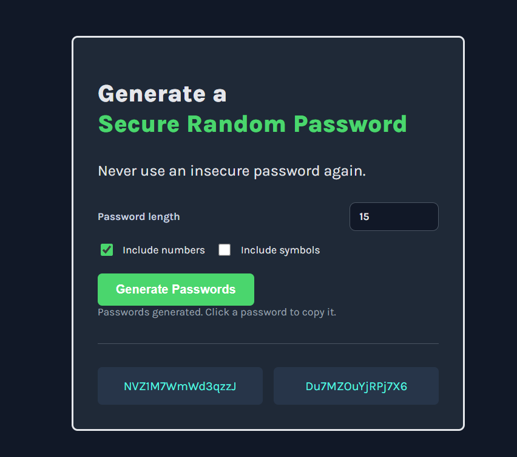

# Password Generator

A lightweight password generator built as part of a Scrimba solo project. The application generates two secure password candidates at once, making it easy to compare, copy, and use strong passwords without extra steps.

## Live Demo

- https://pass-gen-kyu.netlify.app/

## Security Note

This project is a static frontend app. It does not collect, store, or transmit user data, and it does not use a backend, database, or authentication flow. Because of that, there is no sensitive data handled by the app itself.

## About the Project

This project focuses on core JavaScript logic and a clean, minimal UI. It was built to practice working with arrays, random number generation, and DOM manipulation while keeping the experience straightforward and easy to use.

## Features

- Generates two random passwords with one click
- Supports adjustable password length
- Includes toggles for numbers and symbols
- Allows one-click copy by clicking a generated password
- Uses a dark, accessible layout with clear visual hierarchy

## Stretch Goals Implemented

- Adjustable password length
- Toggle numbers on or off
- Toggle symbols on or off
- Click any generated password to copy it to the clipboard

## Tech Stack

- HTML
- CSS
- JavaScript

## How to Use

1. Open `index.html` in your browser.
2. Set the desired password length.
3. Choose whether to include numbers and symbols.
4. Click Generate Passwords.
5. Click a generated password to copy it to the clipboard.

## Screenshot Comparison

### Original Version


### Latest Version



The latest version includes the implemented stretch goals shown in the updated UI, including password length control, number and symbol toggles, and copy-on-click behavior.

## Project Highlights

- Focused, single-purpose utility app
- Clear UI progression from the original Scrimba challenge to the enhanced version
- Suitable for portfolio presentation as a small but complete frontend project

## Folder Structure

```text
password-generator-solproj/
├── index.html
├── index.css
├── index.js
└── ss/
	├── pass-gen-1.png
	└── pass-gen-2.png
```

## Notes

This project is based on Scrimba's frontend learning path and is intended as a compact demo of a practical utility app.
