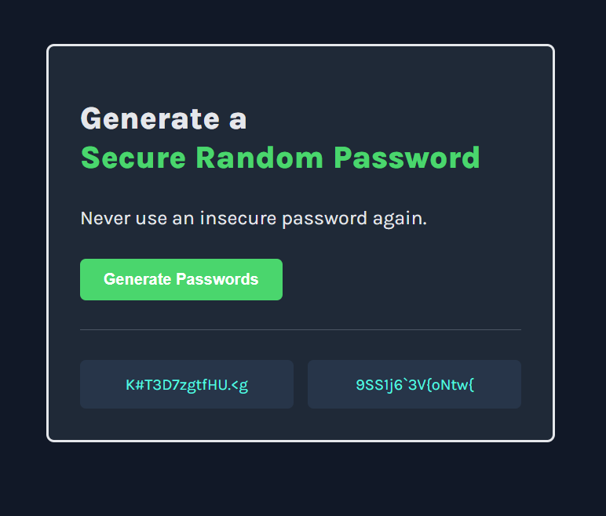

# Password Generator

A simple password generator built as part of a Scrimba solo project. The app creates two random passwords at once so users can quickly copy or compare strong options without extra steps.

## About the Project

This project focuses on core JavaScript logic and a clean, minimal UI. It was built to practice working with arrays, random number generation, and DOM manipulation while keeping the experience straightforward and easy to use.

## Features

- Generates 2 random passwords with one click
- Uses a 15-character password length
- Includes uppercase letters, lowercase letters, numbers, and symbols
- Clean layout with a dark theme and clear visual hierarchy

## Built With

- HTML
- CSS
- JavaScript

## How to Use

1. Open `index.html` in your browser.
2. Click the Generate Passwords button.
3. Copy the generated passwords and use the one you prefer.

## Project Screenshot



## Folder Structure

```text
password-generator-solproj/
├── index.html
├── index.css
├── index.js
└── ss/
	└── pass-gen-1.png
```

## Notes

This project is based on Scrimba's frontend learning path and is intended as a compact demo of a useful utility app.
